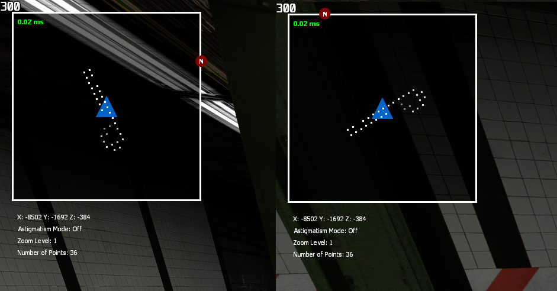
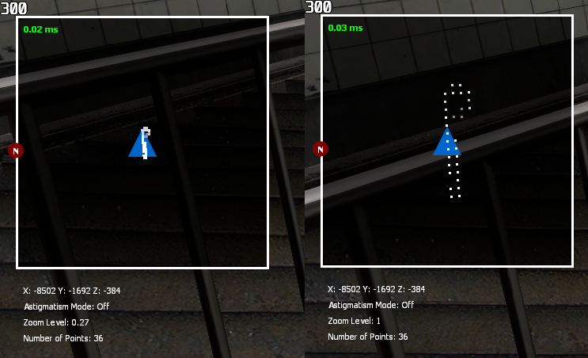
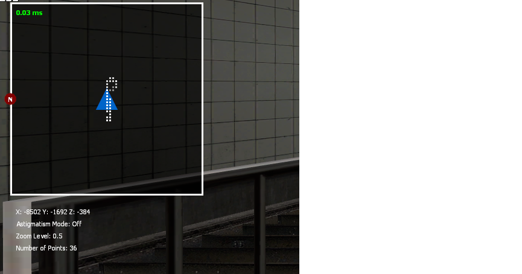
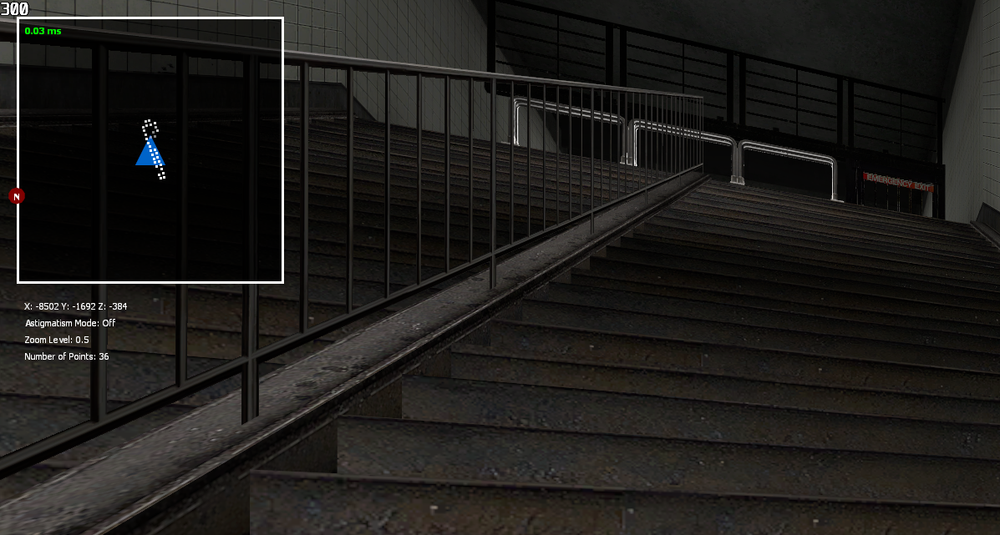

# GMOD Dynamic HUD v0.5 by BlackScout/bscout9956

## Description

This is a "Dynamic Radar" for Garry's Mod that aims to help with navigation in maps without spoiling the experience.
It works through a breadcrumb system that reveals the path on the player's radar as they explore the map, without showing the entire layout at once.

## Features

### Automatic scaling by resolution (WIP)
- 1600x900:

- 1280x720:

Important: Requires mod restart!

### Rotation

### Zooming in and out

### Information/Debug view

### Astigmatism mode (if you can't see white on black very well)

### Fade based on Z level

### Settings panel (WIP)

