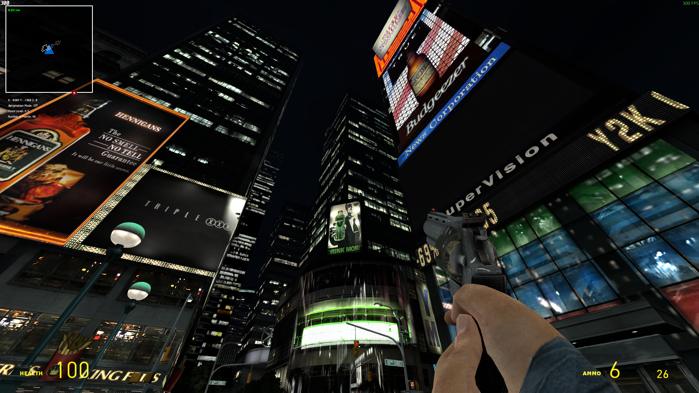

# GMOD Dynamic HUD v0.5 by BlackScout/bscout9956

## Description

This is a "Dynamic Radar" for Garry's Mod that aims to help with navigation in maps without spoiling the experience.
It works through a breadcrumb system that reveals the path on the player's radar as they explore the map, without showing the entire layout at once.

## Features

- Automatic scaling by resolution
- Rotation
- Breadcrumb system
- Zooming in and out
- Information/Debug view
- Astigmatism mode (if you can't see white on black very well)
- Fade based on Z level
- Settings panel (WIP)
