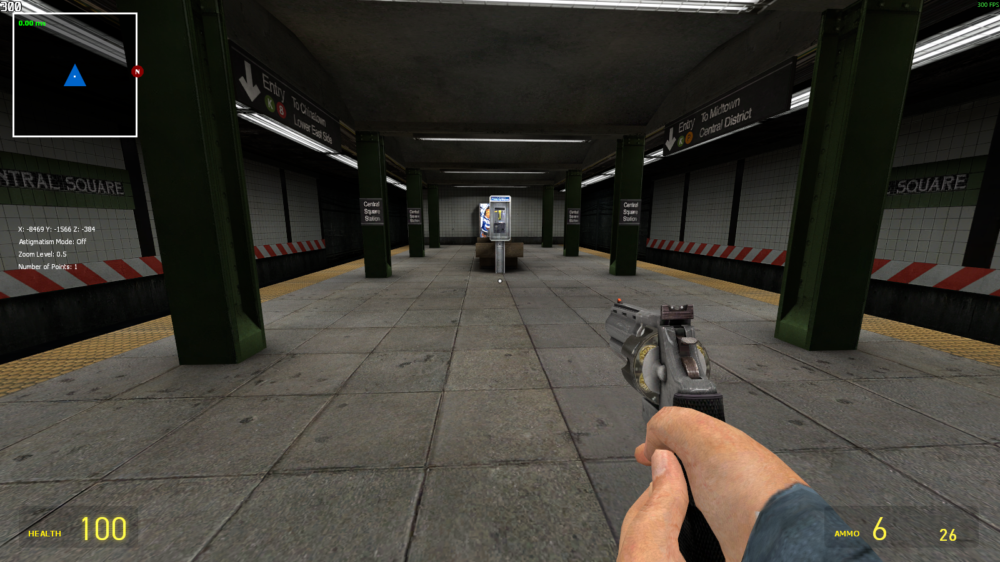
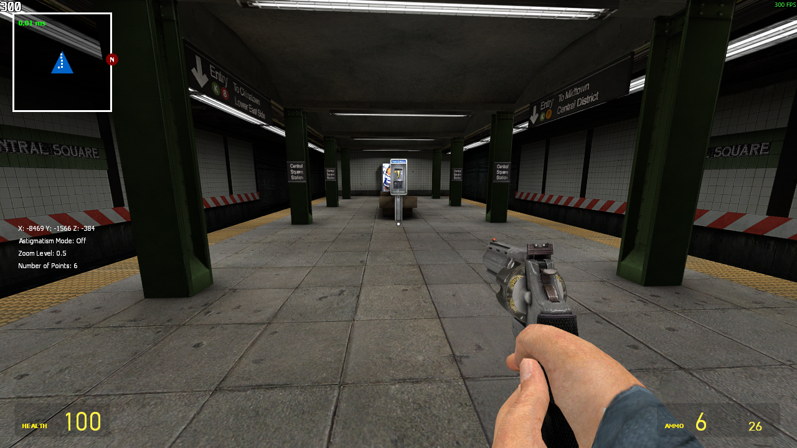
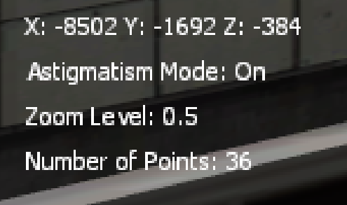
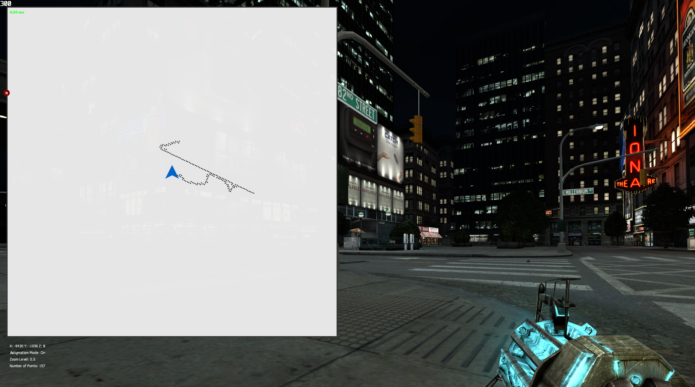

# GMOD DynMap v0.6 by BlackScout/bscout9956

## Description

This is a "Dynamic Radar" for Garry's Mod that aims to help with navigation in maps without spoiling the experience.

It works through a breadcrumb system that reveals the path on the player's radar as they explore the map, without showing the entire layout at once.

## Features

### Automatic UI scaling by resolution

>*"No binoculars required?"*

#### 1600x900

#### 1280x720

---

### Rotation

>*"Is that a six or a nine?"*

---

### Zooming in and out

>*"I wish I could see more of the map... What happens if I press Z?"*

---

### Information/Debug view

>*"Wow, now that's a lot of information!"*

---

### Astigmatism Mode

>*"Where are my glasses?"*

---

### Fade based on Z level

>*"Now the Stairway to Heaven looks less daunting..."*

---

### Settings panel with lots of customization choices

#### Custom scaling for the map size

>*"Wow, it really is huge..."*

